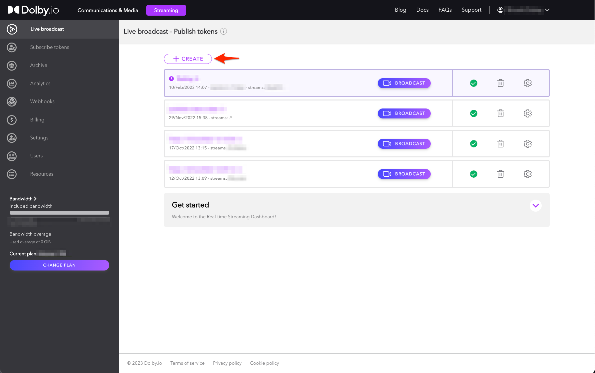
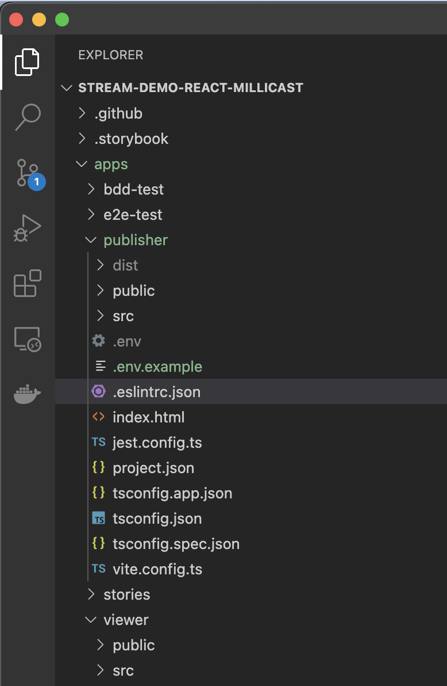
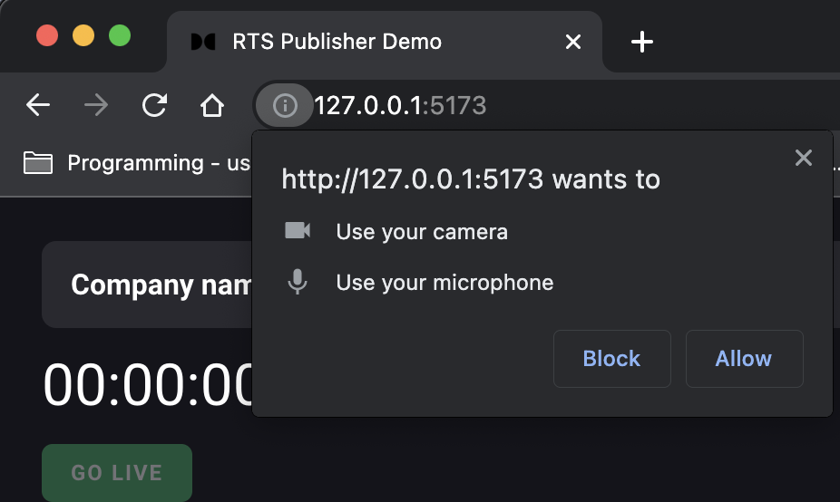

# Real-time Streaming - Publisher & Viewer Sample Apps

<p align="center">

</p>

## Overview

Quickly stand-up a lightning fast, broadcast quality, real-time streaming app with ultra low-latency (sub 500ms).

## Getting Started

### Prerequisites

- Node v16.16.0
- Yarn v1.22.19
- A Dolby.io account

#### How to get a Dolby.io account

To setup your Dolby.io account, go to the [Dolby.io dashboard](https://dashboard.dolby.io/signup/) and complete the form. After confirming your email address, you will be logged in.

## Project structure

This project is setup as a monorepo, and contains the following:

- Publisher app (under `apps/publisher`)
- Viewer/subscriber app (under `apps/viewer`)
- Tests (under `apps/e2e-test/*` )
- Shared components/hooks (under `libs/*`)
- Storybook stories (under `.apps/stories/*`)

> Note: We chose to use [yarn](https://yarnpkg.com/) and [nx](https://nx.dev/) in to our sample app because it helps with our workflow. You are welcome to choose tooling that suits your needs.

The RTS solution is broken down into 2 parts - the publisher (or the broadcaster) and the subscriber (or the viewer). This repository contains sample code for both parts.

## Installation and setup

To install the libraries necessary, clone the repo. Then from the root directory of the project, run the following command in a terminal window:

```bash
yarn
```

### RTS Tokens

In order for this application to work, you need three tokens - `stream name`, `stream account id` and `stream publishing token`. These tokens can be found in your [Dolby.io dashboard](https://streaming.dolby.io/#/tokens), under the <ins>**Streaming**</ins> tab for a given token.



To allow publishing from multiple sources to work with your token, remember to go to advanced settings and enable "Multisource".


Once created, you can grab the stream name, publisher token and stream ID from the Token details page, under the <ins> API </ins>tab.


For your application to pick these values up, you can either set them as environment variables or store them in a `.env` file. The `.env` file must be under `apps/publisher/` and `apps/viewer/`.

```bash
VITE_RTS_STREAM_NAME=<your stream name>
VITE_RTS_STREAM_PUBLISHING_TOKEN=<your stream token>
VITE_RTS_ACCOUNT_ID=<your account id>
```

**note** : This file is typically not added to git. When you clone the repo, you will not find this file and will have to create one yourself. The `.env.example` app can be used as a template with basic keys. Rename the file to `.env` and insert your tokens to get the file up and running.



**Note**: Please set these env variables before you launch the apps. You can either set them via the command line in your shell environment or by entering them in your .env file.

#### Configuring the viewer link

The viewer link is configured in the `.env` file in your `apps/publisher` directory, or in your shell/systen environment variables. To set the URL, insert/update the following variable:

```bash
VITE_RTS_VIEWER_BASE_URL=<Your URL goes here>
```

> If you are using a particular port number, please add this to the URL. The best way to do this is to first [run the viewer app](#running-the-viewer-app), grab the URL from your browser and add it to your `.env` file as such.

```bash
VITE_RTS_VIEWER_BASE_URL=http://localhost:5174/
```

#### Running the publisher app

```bash
yarn nx serve publisher
```

**Note**: Remember to grant the publisher app all the necessary camera and microphone permissions.



#### Running the viewer app

To run your app in dev mode, run the following command in your terminal and open the browser:

```bash
yarn nx serve viewer
```

## Features, roadmap and limitations

### RTS Publisher

- [x] Publish streams
- [x] Publish with simulcast (only on Chrome)
- [x] Microphone and camera device selection
- [x] Invite viewers to watch your stream
- [x] Screen sharing
- [x] Mute audio and video
- [x] Resolution, bandwidth, codec, and bitrate selection
- [x] Ability to stream from up to 4 sources. See [here](https://docs.dolby.io/streaming-apis/docs/create-multi-view-web-app) for bandwidth limitations.
- [x] Ability to stream a local video file
- [x] Observing stream statistics for each simulcast layer
- [ ] Recording your streams

### RTS Viewer

- [x] View streams
- [x] Mute audio and video
- [x] Select incoming stream quality with simulcast
- [x] Ability to see stats for each individual source
- [ ] Chromecast support
- [ ] Picture in picture support

### Issues and Bugs

The apps and components provided here should be used as reference material. Although we have taken great care in creating these, please note that they are not intended for real production use and there may be some bugs.

Please report any issues under `Issues` on our [GitHub](https://github.com/dolbyio-samples/stream-demo-react-millicast/issues) and appropriately label them. Please review the existing open issues before raising a new one.

### Browser compatibility

While utmost care has been taken to ensure this works across all browsers, please note that there are some limitations and therefore, we recommend Chromium based browsers or Safari as the best means to test out these applications. Features such as simulcast only work on Chromium based browsers, for example.

Generally speaking, our app has been tested to work on the following browser versions:

- Google Chrome v100+
- Apple Safari v16.x
- Edge v107.x

There are known limitations with webRTC and Mozilla Firefox, and therefore the browser is not recommended.

## More resources

Want to learn more? Check out the [Real Time Streaming app gallery page](https://docs.dolby.io/communications-apis/docs/real-time-streaming-publisher-viewer-sample-apps).

Looking for more sample apps and projects? Head to the [Project Gallery](https://docs.dolby.io/communications-apis/page/gallery).
