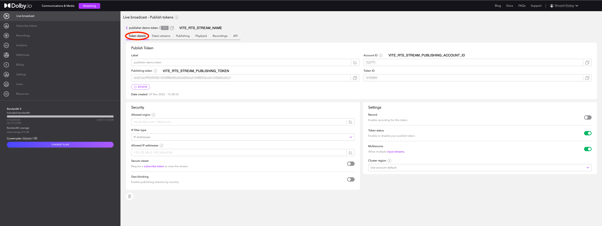

# WIP: stream-demo-react-milicast

A sample app to showcase the capabilities of the Millicast SDK and how it can be used to design solutions that require ultra low latency (sub 500ms).

## Prerequisites

In order to run this demo, you will need a Dolby.io account. If you don't already have one, you can create one on [our website](https://dashboard.dolby.io).

## Project structure

This project is setup as a yarn based nx-managed monorepo, and contains the following

- Publisher app (under `apps/publisher`)
- Viewer/subscriber app (under `apps/subscriber`)
- Tests (under `tests/*` )
- Shared components/hooks (under `libs/*`)
- Storybook stories (under `.storybook/*`)

The Millicast solution is broken down into 2 parts - the publisher (or the broadcaster) and the subscriber (or the viewer). This repository contains sample code for both parts.

## Installation and setup

To install the libraries necessary, run the following command.

```bash
yarn
```

### Millicast Tokens

In order for this application to work, you need three sets of tokens - `stream name`, `stream account id` and `stream publishing token`. These tokens can be found in your [Dolby.io dashboard](https://streaming.dolby.io/#/tokens), under the streaming tab for a given token.



```bash
VITE_MILLICAST_STREAM_NAME=<your stream name>
VITE_MILLICAST_STREAM_PUBLISHING_TOKEN=<your stream token>
VITE_MILLICAST_STREAM_ID=<your stream id>
```

**Note**: please set these env variables before you launch the apps. You can either set them via the command line or by entering them in your .env file.

#### Run the publisher app in dev mode

```bash
yarn nx serve publisher
```

#### Build the publisher app and preview it

Run the command below in terminal and open the browser

```bash
yarn nx preview publisher
```

#### Run the end to end test

```bash
yarn nx e2e publisher
```

### Add a new component in libs

After the command below, your component should be in `libs/<your component name>`

```bash
yarn nx g @nxext/vite:library <your component name>
```

### Storybook

If you need storybook to support your UI component development, add your component code in `libs`, and add the story into `apps/stories`. Also don't forget to add your component path in `.storybook/main.ts`
Then, run the command below:

```bash
yarn nx storybook stories
```

## Project roadmap

We will be working towards delivering these milestone items over the coming months. Please be mindful that we are not committing to any timelines right now.

- [ ] Ability to stream from 2+ sources.
- [ ] Ability to have multiple publishers.
- [ ] Recording your streams.

## Browser compatibility

While utmost care has been taken to ensure this works across all browsers, please note that there are some limitations and therefore, we recommend chromium based browsers or safari as the best means to test out these applications. Some known issues are.

- Simulcast only works when the publisher is on chrome (and uses H.264 or VP8 as the codec).
- Screen sharing does not reliably work with Firefox.

## Known Issues

The functionality provided here is supposed to serve as reference material, so while complete care was taken while creating these apps, please note that they are not intended for usage in real-world scenarios and as such, may have some bugs. To report a bug, please report them under `Issues` on our [GitHub](https://github.com/dolbyio-samples/stream-demo-react-millicast/issues) and appropriately label them. Please go through the existing open issues before raising a new one.
