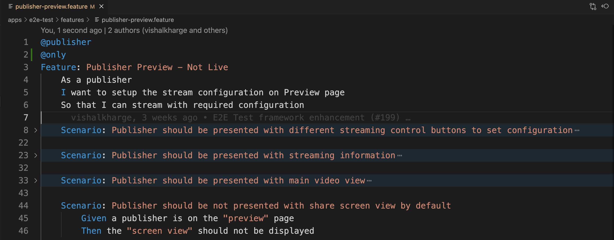
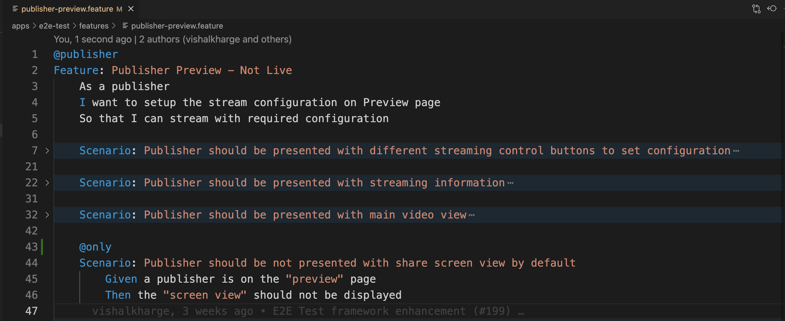
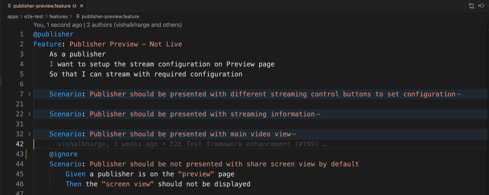

# E2E-Test Framework

The test automation framework for end-to-end testing with Cucumber-JS and Playwright. It abstracts browser interaction to simple steps that are written from a user perspective.

## Prerequisites

In order to run the automated test, you will need the following tools installed on your machine.

- NodeJS v16.16.0
- Yarn v1.22.19

## Project structure

This project is setup as a yarn based nx-managed monorepo, and e2e tests are located under apps/e2e-test/\* and contains the following:

- features: contains the bdd feature files which has scenarios
- selector-mappings: contains the element locators stored in yaml or json file with component and page model
- src: contains the config, hooks, logger, utils, step definitions, reporter and playwright tool specific actions
- scripts: contains the bash script to install publisher and viewer app locally
- reports: contains the test execution artifacts and HTML report
- test.config.ts: contains the test config

## Installation and setup

To install the necessary libraries, clone the repo. Then from the root directory of the project, run the following command in a terminal window:

```bash
yarn
```

## [Optional] Publisher and Viewer app installation locally

Follow the RTS Tokens section of the main ReadMe [ReadMe file](../../README.md) to configure the token as environment variable.

To launch the Publisher and Viewer App locally, run the following command:

```bash
yarn nx launch-server e2e-test
```

Once the script is executed, open the .test.env file to get the Publisher and Viewer URL

```bash
cat .test.env
VIEWER_URL=http://localhost:4173/
PUBLISHER_URL=http://localhost:4174/
```

## Setup Browser and Headless Mode for test execution:

Tests are executed on chrome browser and in headless mode by default.

To set the different browser, insert/update the following variable in the bash environment:

```bash
export BROWSER_NAME=<chrome/firefox/chromium>
```

To set the HEADLESS mode, insert/update the following variable in the bash environment:

```bash
export HEADLESS=<true/false>
```

## Setup Publisher and Viewer app URL for test execution:

If the Publisher and Viewer app is launched locally using the 'yarn nx launch-server e2e-test' command then skip setting the PUBLISHER_URL and VIEWER_URL environment variables.
To set the Publisher and Viewer URL, insert/update the following variable in the bash environment:

```bash
export PUBLISHER_URL='http://localhost:4174/'
export VIEWER_URL='http://localhost:4173/'
```

To set if the Viewer URL has dynamic stream name, insert/update the following variable in the bash

```bash
export DYNAMIC_STREAM_NAME=<true/false>
```

## Test Execution and Report

### Run All Tests/Features

```bash
yarn nx test e2e-test --skip-nx-cache
```

### Run Specific Tests/Features/Scenarios

To run the all the scenarios from a specific feature file, tag the feature with `@only` as shown below:



To run the specific scenario(s) from a feature file, tag the scenario(s) with `@only` as shown below:



```bash
yarn nx only e2e-test --skip-nx-cache
```

### Ignore Tests

To ignore the test execution of specific scenario(s) or feature file, tag it with `@ignore` as shown below:



```bash
yarn nx test e2e-test --skip-nx-cache
```

### Generate HTML Reports

```bash
yarn nx test-report e2e-test --skip-nx-cache
```

HTML test report will be available under apps/e2e-test/reports/\* directory.
